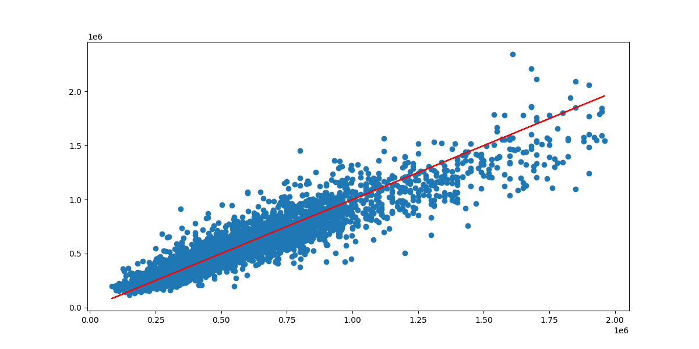

# Housing Model 🤖

> Model that predicts what will be the price of a housing based on the number of bedrooms, bathrooms, square footage, etc.

## Results

> Verify that train/test data is not over fitting:


> Real prices vs predictions done by the model:


## Train/Test data analytics

> Count how many data we have with determined number of bedrooms


> Price distribution in **King County** city. This plot has been created
> by using the `lat` and `long` fields to create the map of the city.
> Greener values mean higher prices, redder means cheaper.


> Price distribution by the number of bedrooms:


> Price distribution by month:


> Price distribution by year:


> Price distribution by if the house/apartment is waterfront or not:


## Running

To run the model first create a new Python environment and activate it. I'm using [Anaconda](https://www.anaconda.com/) for that:

```shell
conda create -n housing_env python=3.11
conda activate housing_env
```

Now install all the project dependencies:

```shell
make install-all
```

And run the model:

```shell
make model
```

After running you model, it will be saved inside `storage/housing-model.keras`.
To just run your recent created model and predict a random value from our data set,
use the following script:

```shell
make predict 
```

Remember that for this to work, you need to run `make model` first to create your model.
